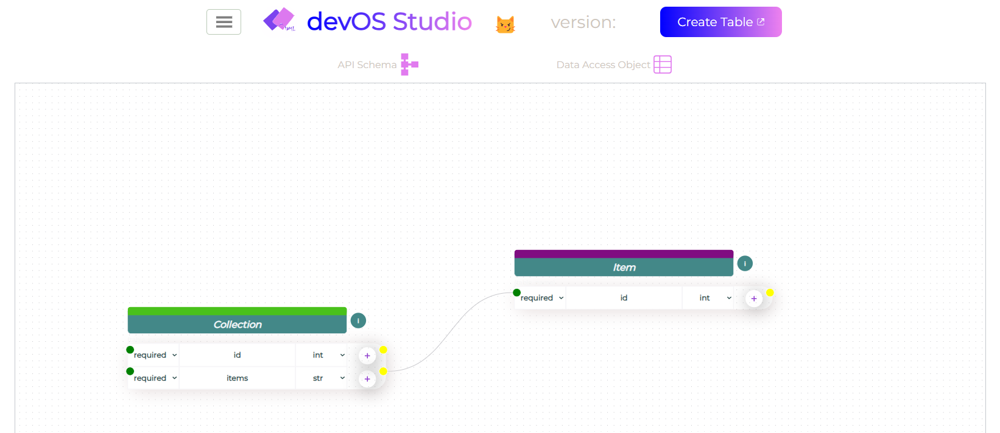
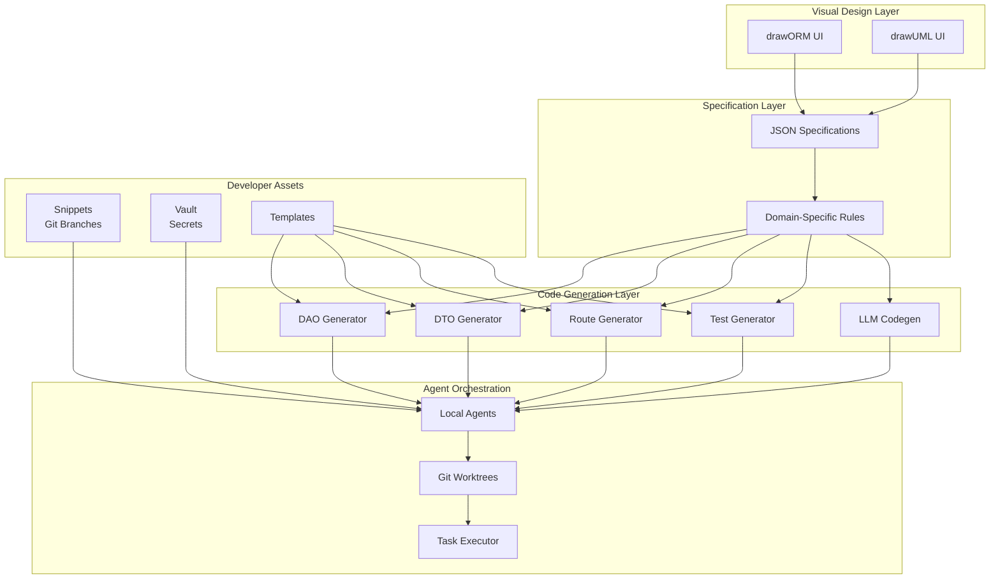
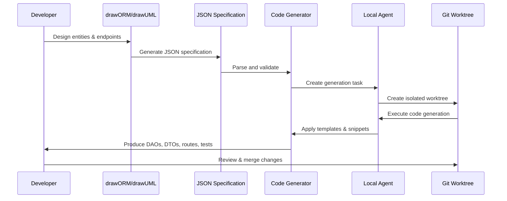
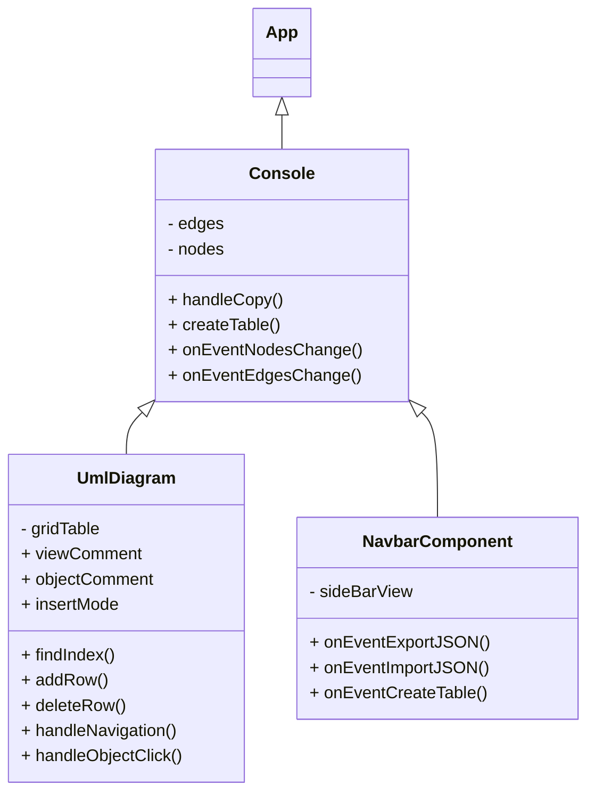

# 😼 devOS

<div style="display:flex;">
  <h1>Development Operating System</h1>
  
</div>

**devOS** is a development acceleration toolkit that combines visual design tools,
code generation, local AI agents, and version-controlled snippets to eliminate the
gap between prototype and production code.



---

## TL;DR — devOS in 5 Minutes

### Assumptions

- You are inside an active **git repository**
- You have **Node.js** and **Codex CLI** installed
- Your Python virtual environment is **activated**

### Configure a Project

Point devOS at your project's directories and language once, then everything else
(code gen, snippets, agents) reads from that config.

```bash
devos config
```

This writes `specs/project_config.json` with paths for DAOs, DTOs, routes, and tests.

---

### Build Project Artefacts

Generate DAOs, DTOs, CRUD routes, and tests from your JSON specification:

```bash
devos build project_name   # full build — all artefacts for the named project
devos build dao            # DAOs only
devos build dto            # DTOs only
devos build routes         # API routes only
devos build tests          # test scaffolding only
```

---

### Launch the ORM Builder UI

Open the visual entity designer (drawORM) in your browser:

```bash
devos ui path,to,devos
```

> If this doesn't work, make sure you have Node.js installed and run `npm install` in the `devOS/frontend` directory.

Design entities, set field types and relationships, then export directly to
`specs/dao_spec.json`.

---

### Managing Credentials

Store per-project environment variables in the **vault** (outside of git):

```
vault/
  dotenv_project_name          # project-specific .env values
  dotenv_example_project_name  # template for new developers
```

Load credentials into the current shell:

```bash
devos credentials load project_name
```

---

### Managing Secrets

Global secrets (not tied to any single project) live at the vault root:

```
vault/
  global_secret_{secret_key}
```

Access them programmatically through the credentials use case, or load them the same
way as project credentials:

```bash
devos credentials load --global secret_key
```

---

### Managing Snippets

Snippets are reusable code stored as **git branches**. Pull any snippet directly into
your project:

```bash
devos snippets list                              # browse available snippets
devos snippets pull python/sqlalchemy_adapter    # copy snippet into project
devos snippets push infrastructure/adapters.py --branch python/database-adapters
```

Categories include Python adapters, TypeScript components, GitHub Actions workflows,
Dockerfiles, prompts, and Copilot instruction files.

---

### Using Agents

Agents create isolated **git worktrees**, implement a task autonomously, then wait
for your review:

```bash
devos agent create "Implement user authentication endpoint"
devos agent review task-user-auth   # inspect the worktree branch
git merge worktrees/task-user-auth/feature-branch
```

Agents read `AGENTS.md` for architectural guidance and use local LLMs — no cloud
dependencies required.

### Keeping devOS Up to Date

Add [devOS_profile.ps1](devOS_profile.ps1) to your PowerShell profile. It exposes a
`dev-update` alias that pulls the latest changes, reinstalls the package into the
currently activated environment, and returns you to your project directory:

```powershell
# From your project directory (devOS lives one level up by default)
dev-update

# Specify a different devOS location or return directory
dev-update -DevOSPath "C:/path/to/devOS" -TargetDir "my-project"
```

> **Activate your environment before running `dev-update`** — the script installs
> directly into whatever `pip` is on your `PATH`.

---

## Table of Contents

- [TL;DR — devOS in 5 Minutes](#tldr--devos-in-5-minutes)
- [Philosophy](#philosophy)
- [Core Components](#core-components)
- [Installation](#installation)
- [Key Concepts](#key-concepts)
- [Architecture](#architecture)
- [Code Generation](#code-generation)
- [Software Design](#software-design)
- [Usage](#usage)

---

## Philosophy

The advent of LLMs means there's **no excuse** for not having tests, documentation,
and high-quality clean code. devOS is built on these principles:

1. **Prototype first, refactor with design** — Write messy code to understand the
   problem, then use devOS to rewrite it properly
2. **First version is always throwaway** — Accept that prototypes are learning tools,
   not production artifacts
3. **Specifications over implementations** — JSON specifications export to any
   language and avoid AST parsing errors
4. **Version-controlled development assets** — Snippets, prompts, and configs live in
   git branches, not scattered files
5. **Local-first agent workflows** — Proprietary projects need local agents working
   on git worktrees, not cloud services

devOS is **not distributed via PyPI**. It's meant to be **cloned** into each project
where you can:

- Customize default configs and settings for your team
- Maintain your own snippets as git branches
- Use it as a secrets vault
- Run local agents without cloud dependencies

---

## Core Components

### drawORM — Visual ORM Designer

A UI ORM builder powered by
[React Flow](https://reactflow.dev/docs/guides/custom-nodes/), inspired by
[drawSQL](https://drawsql.app/).

**Purpose:** Refactoring tool for data models

- Design your domain entities visually
- Generate DAOs, DTOs, CRUD routes, and tests automatically
- Syncs specifications bidirectionally (like xstate, but for Clean Architecture)

### drawUML — Specification Builder

A domain-specific visual language on top of JSON for defining:

- Endpoints and schemas
- Advanced behaviors (on-delete rules, data transformations, pre/post-instantiation
  hooks)
- Business logic constraints

**Why JSON specifications?**

- Easier to export to different programming languages
- Less error-prone than building abstract syntax trees
- Machine-readable for LLM code generation
- Type-safe and version-controllable

### Local AI Agents

devOS spins up agents locally that:

- Create git worktrees for isolated task execution
- Work on features/fixes without touching your main branch
- Operate entirely offline (crucial for proprietary projects)
- Leverage local LLM code generation when programming language isn't specified

---

## Installation

### Prerequisites

- **Node.js** v18 or above
- **Python** 3.10 or above
- An active **git repository** (devOS extracts repo name, tags, etc.)
- (Optional) **Codex account** and **TickTick developer account** for AI agent
  integration

### Setup

1. **Clone devOS into your project:**

```bash
git clone https://github.com/kesler20/devOS.git
cd devOS
```

2. **Run the setup command:**

```bash
devos setup
```

This will:

- Install the ORM builder UI (React frontend)
- Install the Codex CLI for AI agents
- Configure environment variables
- Set up code snippets as git branches

3. **Configure your vault:**

Store credentials and secrets outside of GitHub:

```
vault/
  dotenv_project_name
  dotenv_example_project_name
  global_secret_{secret_key}
```

Secrets are not project-specific and can be stored at the vault root level.

4. **Verify installation:**

```bash
devos --version
```

---

## Key Concepts

### Specification-Driven Development

devOS assumes you update **DAOs and endpoints via specifications**, freeing you to
focus on:

- Writing use cases
- Implementing adapters (services)
- Creating comprehensive tests

### The Vault

A collection of credentials and secrets stored **outside of GitHub** that can be
shared with team members.

**Structure:**

- `dotenv_project_name` — Project-specific environment variables
- `dotenv_example_project_name` — Example template for new developers
- `global_secret_{secret_key}` — Non-project-specific secrets

### Snippets as Version-Controlled Assets

**Snippets** are reusable code stored as **git branches** that can be pulled into any
project:

- Adapters, utils, and helpers
- Prompts and AGENTS.md files
- GitHub Actions workflows
- Copilot instruction files
- Dockerfiles and mocks

**Philosophy:** Clone devOS, update snippets in your own repo, and use it to speed up
development across all your projects.

### Configuration Paths

Paths are entered as **comma-separated lists** to remain platform-agnostic.

**home_root configs:**

- Global configs using the user home directory as root
- Paths start from `~` or `$HOME`

**project_root configs:**

- Project-specific paths starting from the repository root
- Define directories, filenames, and programming languages for generated code

### ORM Builder UI Guidelines

- Use **array types** to indicate one-to-many relationships
- AI autocomplete is available in the editor for endpoint definitions
- Visual design syncs bidirectionally with JSON specifications

---

## Architecture

### System Overview



### Data Flow



### Clean Architecture Layers

devOS enforces Clean Architecture principles through code generation:

```
┌─────────────────────────────────────────┐
│          Domain Layer                    │
│  • entities.py (DAOs)                   │
│  • Business rules & constraints         │
└─────────────────────────────────────────┘
              ↓
┌─────────────────────────────────────────┐
│        Use Cases Layer                   │
│  • crud_dto.py, custom_dto.py           │
│  • use_cases.py                         │
│  • ports.py (interfaces)                │
└─────────────────────────────────────────┘
              ↓
┌─────────────────────────────────────────┐
│      Infrastructure Layer                │
│  • crud_routes.py, custom_routes.py     │
│  • adapters.py                          │
│  • schema.py (external contracts)       │
└─────────────────────────────────────────┘
              ↓
┌─────────────────────────────────────────┐
│          Tests Layer                     │
│  • unit_tests.py                        │
│  • integration_tests.py                 │
└─────────────────────────────────────────┘
```

**Dependency Rule:** Inner layers never depend on outer layers.

---

## Code Generation

### Supported Languages

- **Python** (FastAPI, SQLAlchemy, Pydantic)
- **TypeScript** (React, Express, type definitions)
- **More languages** via LLM codegen when not explicitly supported

### Generation Workflow

1. **Design in drawORM/drawUML** — Visually define entities, relationships, and
   endpoints
2. **Export JSON specification** — Domain-specific rules encoded as JSON
3. **Run code generator:**

```bash
devos build              # Generate all artifacts
devos build dao          # Generate DAOs only
devos build dto          # Generate DTOs only
devos build routes       # Generate API routes only
devos build tests        # Generate test scaffolding only
```

4. **LLM Integration** — When programming language is not specified, devOS invokes an
   LLM codegen agent using `AGENTS.md` for architectural guidance

### Test Generation

- **Service tests:** Code generator searches for files with `@service` marker
- **API tests:** Generates tests only for endpoints created by devOS code generator

### Extending Generated Code

Generated code is **importable** and **extensible**:

```python
# Import generated routes
from generated_endpoints import app

# Extend with custom routes
@app.route("/custom_endpoint", methods=["POST"])
def custom_endpoint():
    return {"message": "Custom logic here"}
```

### Suggested Project Structure

```
project/
├── domain/
│   └── dao.py                    # Generated entities
├── use_cases/
│   ├── crud_dto.py               # Generated CRUD DTOs
│   ├── custom_dto.py             # Your custom DTOs
│   ├── use_cases.py              # Your business logic
│   ├── ports.py                  # Interfaces for adapters
│   └── utils/                    # Shared utilities
├── infrastructure/
│   ├── crud_routes.py            # Generated CRUD routes
│   ├── custom_routes.py          # Your custom routes
│   ├── adapters.py               # External service adapters
│   └── schema.py                 # Third-party contracts
└── tests/
    ├── unit_tests.py             # Generated unit tests
    └── integration_tests.py      # Generated integration tests
```

---

---

## Software Design

### React Component Architecture

The frontend is built with React + TypeScript following event-driven patterns
outlined in `AGENTS.md`.



### Console Design (Container Component)

**View:** The Console component is divided into two sections:

1. **NavbarComponent** — Uses `createTable` and `handleCopy` to modify parent state
2. **React Flow Grid** — Uses `UmlDiagram` as custom nodes:

```jsx
const nodeTypes = { umlDiagram: UmlDiagram };
```

**State:** The node data structure:

```jsx
{
  id: `node-${nodes.length + 1}`,
  type: "umlDiagram",
  position: { x: 10, y: 10 },
  data: {
    objectName: "Object Name",
    comment: "Object Description",
    color: getRandomColor(),
    gridTable: [
      {
        visibility: "+",
        signature: "",
        type: "",
        comment: "signature description",
      },
    ],
  },
}
```

This data is passed to `UmlDiagram` via the `data` prop and modified through:

- `addRow()` / `deleteRow()` — Manage entity fields
- `handleObjectClick()` — Select/focus entities
- `handleNavigation()` — Keyboard navigation within the grid

### Backend Architecture

Follows Clean Architecture principles (see `AGENTS.md`):

```
domain/ → use_cases/ → infrastructure/
```

- **domain/entities.py** — Business entities and DAOs
- **use_cases/** — Business logic, DTOs, and ports
- **infrastructure/** — Adapters, routes, clients, and external contracts

---

## Usage

### Quick Start

1. **Launch the ORM builder:**

```bash
devos ui
```

2. **Design your entities:**
   - Drag nodes onto the canvas
   - Define fields with types and relationships
   - Add constraints and validation rules

3. **Export specification:**

```bash
devos export --output specs/dao_spec.json
```

4. **Generate code:**

```bash
devos build
```

5. **Implement use cases:**

Write your business logic in `use_cases/use_cases.py` using the generated DTOs and
DAOs.

6. **Run tests:**

```bash
pytest tests/
```

### Working with Local Agents

1. **Create a task:**

```bash
devos agent create "Implement user authentication endpoint"
```

2. **Agent creates a worktree:**

```
project/
├── .git/
└── worktrees/
    └── task-user-auth/     # Isolated environment
```

3. **Agent works autonomously:**
   - Reads specifications
   - Generates code using templates and LLM
   - Writes tests
   - Commits changes to worktree branch

4. **Review and merge:**

```bash
devos agent review task-user-auth
git merge worktrees/task-user-auth/feature-branch
```

### Managing Snippets

1. **List available snippets:**

```bash
devos snippets list
```

2. **Pull snippet into project:**

```bash
devos snippets pull python/sqlalchemy_adapter
```

3. **Update snippet from project:**

```bash
devos snippets push infrastructure/adapters.py --branch python/database-adapters
```

4. **Create custom snippet:**

```bash
devos snippets create utils/validators.py --branch python/validation
```

### Configuration

Edit `specs/project_config.json` to customize:

```json
{
  "home_root": {
    "vault_path": ["vault"],
    "snippets_repo": "https://github.com/your-org/devos-snippets"
  },
  "project_root": {
    "dao_dir": ["src", "domain"],
    "dao_filename": "entities.py",
    "dto_dir": ["src", "use_cases"],
    "routes_dir": ["src", "infrastructure"],
    "tests_dir": ["tests"],
    "programming_language": "python"
  }
}
```

---

## Why devOS?

### The Problem

With LLMs, we can generate high-quality code faster than ever. But we still:

- Write throwaway prototypes that never get refactored
- Lack tests and documentation
- Rebuild the same patterns across projects
- Struggle to maintain consistency in large teams

### The Solution

devOS bridges the gap between **prototype** and **production**:

1. **Visual design tools** eliminate manual boilerplate
2. **JSON specifications** ensure portability and type safety
3. **Local agents** work autonomously on isolated worktrees
4. **Version-controlled snippets** standardize patterns across projects
5. **LLM integration** handles unsupported languages and edge cases

### When to Use devOS

✅ **Use devOS when:**

- Starting a new project that needs Clean Architecture
- Refactoring a prototype into production code
- Standardizing patterns across multiple projects
- Working on proprietary code that can't use cloud AI services
- You want generated tests, docs, and scaffolding automatically

❌ **Don't use devOS when:**

- Building a quick throwaway script
- Project structure is too unique for code generation
- Team prefers full manual control over every file

---

## Contributing

devOS is designed to be **forked and customized**. To contribute:

1. Fork the repository
2. Update snippets, templates, or generators
3. Submit a PR with your improvements
4. Or keep your fork private and sync upstream changes periodically

---

## License

MIT License — See [LICENSE](LICENSE) for details.

---

## Roadmap

- [ ] Support for more programming languages (Go, Rust, Java)
- [ ] GraphQL schema generation
- [ ] Integration with more task management tools (Jira, Linear, etc.)
- [ ] Cloud-hosted agent orchestration (optional)
- [ ] Real-time collaboration on drawORM canvas
- [ ] Export to OpenAPI/Swagger specifications
- [ ] Plugin system for custom code generators

---

**Built with ❤️ by developers who are tired of rewriting the same code.**
